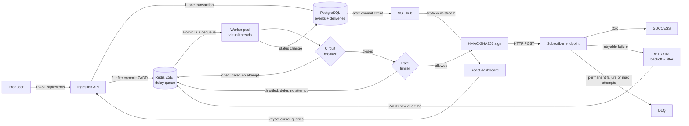

# webhook-delivery-engine
A B2B infrastructure system that ingests events, fans them out to subscriber endpoints, and delivers them as signed webhooks with retries, rate limiting, circuit breaking, and a real-time delivery dashboard.
> **Delivery semantics: at-least-once.** A crash after a receiver processed a request but before we recorded `SUCCESS` causes a duplicate delivery. Every request carries an `X-Webhook-Id` header so receivers can deduplicate.
<!-- TODO: add a GIF of the grid updating live while a burst of events is sent -->
<!--  -->
Features
Area	What it does
Async dispatch pipeline	Events are persisted, fanned out into one delivery per active subscriber, queued in Redis, and sent by virtual-thread workers
Retries	Exponential backoff with full jitter, retry classification (timeouts, 408, 429, 5xx retry; other 4xx go straight to the DLQ), configurable max attempts
Dead-letter queue	Exhausted or permanently failing deliveries land in `DLQ` and can be replayed with one call or one click
Security	HMAC-SHA256 signature over `timestamp.body`, per-subscriber secret shown once at creation, constant-time verification, replay window
Rate limiting	Redis sliding-window limiter per subscriber (atomic Lua script). Throttled deliveries are rescheduled and do not burn an attempt
Circuit breaker	One Resilience4j breaker per subscriber. While open, deliveries are parked without calling the endpoint and without burning attempts
Crash safety	A reaper requeues stuck `IN_FLIGHT` rows. A recovery job re-enqueues due rows missing from Redis. Postgres is the source of truth
Delivery grid	React + TanStack Table with server-side sorting and filtering, keyset (cursor) infinite scroll, and row virtualization
Real-time updates	SSE stream, buffered for 500 ms and patched into the TanStack Query cache without refetching
Dashboard	Success rate, p95 latency, DLQ count, status breakdown, and per-subscriber breaker health
Tech stack
Backend: Java 21, Spring Boot (MVC with virtual threads), Spring Data JPA, JDBC for the query API, Flyway, Resilience4j
Data: PostgreSQL (source of truth), Redis (delay queue and rate limiter)
Frontend: React, TypeScript, Vite, TanStack Query v5, TanStack Table v8, TanStack Router, TanStack Virtual
Dev infrastructure: Neon (Postgres) and Upstash (Redis) hosted free tiers. `docker-compose.yml` provides local Postgres and Redis.
Architecture

Delivery state machine
```
PENDING ──► IN_FLIGHT ──► SUCCESS
   ▲            │
   │            ├──► RETRYING ──► (back to IN_FLIGHT on its next due time)
   │            │
   └─ replay ── └──► DLQ   (max attempts, or non-retryable 4xx)
```
Data model
`subscribers(id, name, url, secret, rate_limit_per_min, active)`
`events(id, type, payload jsonb, idempotency_key unique)`
`deliveries(id, event_id, subscriber_id, status, attempt_count, next_attempt_at, last_http_status, last_error, latency_ms, created_at, updated_at)`
Schema changes are Flyway migrations in `backend/src/main/resources/db/migration`.
Key design decisions
Redis ZSET as a delay queue, Postgres as the source of truth. Redis holds only delivery IDs scored by due time. Every state change is written to Postgres first, then Redis. If Redis loses data, the recovery job rebuilds the queue from rows that are due.
Atomic dequeue. A Lua script finds due IDs and removes them in one step, so two pollers can never grab the same delivery.
Enqueue after commit. Ingestion commits the event and delivery rows, then enqueues. A worker can never see an ID whose row doesn't exist yet.
Full jitter backoff. Delay is uniform in `[0, min(cap, base * 2^(attempt-1))]`. When a subscriber recovers from an outage, retries spread out instead of arriving in synchronized waves.
Throttled and breaker-deferred deliveries don't burn attempts. A delivery shouldn't reach the DLQ because we were polite to a receiver or its endpoint was down. The breaker and limiter run before `attempt_count` is touched.
What counts as endpoint failure for the breaker. Timeouts, connection errors, 408, 429, and 5xx. A 404 or 401 means the server is up (a configuration problem), so it counts as a success for the breaker and goes to the DLQ via the retry rules.
Rate limiter fails open. If Redis errors during the check, the delivery proceeds. A rare missed throttle beats stranded deliveries.
Sign exactly the bytes sent. The worker serializes the payload once, signs those bytes, and sends those same bytes. Receivers verify against the raw body.
Keyset pagination, not OFFSET. The API returns an opaque cursor encoding `(sort value, id)`. Sorting is restricted to three whitelisted, indexed columns, and the SQL fragment comes from an enum, never from request input. See Performance.
SSE, not WebSockets. Data flows one way, `EventSource` reconnects automatically, and it works over plain HTTP. Server events are published after the database commit, through a single dispatcher thread, so a slow browser can't stall a delivery worker.
Frontend cache patching. SSE messages are buffered in a `Map` keyed by delivery ID and flushed every 500 ms. The flush patches matching rows inside the cached infinite-query pages. Deliveries the current view hasn't loaded produce a "N new updates" pill instead of client-side inserts, which would break cursor consistency. A reconnect triggers a catch-up refetch.
Signature verification
Each request carries:
```
X-Webhook-Id: <delivery uuid>          (stable across retries; use it to deduplicate)
X-Webhook-Event: <event type>
X-Webhook-Signature: t=<unix seconds>,v1=<hex hmac-sha256>
```
The signature is `HMAC_SHA256(secret, "<t>." + rawBody)`. A fresh timestamp and signature are generated on every attempt. Receivers should reject timestamps older than a few minutes (replay protection) and compare signatures in constant time.
```js
import crypto from "node:crypto";

// rawBody must be the exact bytes received, not re-serialized JSON.
export function verify(secret, header, rawBody, toleranceSec = 300) {
  const parts = Object.fromEntries(header.split(",").map((p) => p.split("=")));
  const t = Number(parts.t);
  if (!t || Math.abs(Date.now() / 1000 - t) > toleranceSec) return false;
  const expected = crypto.createHmac("sha256", secret)
    .update(`${t}.`).update(rawBody).digest("hex");
  const a = Buffer.from(expected), b = Buffer.from(parts.v1 ?? "");
  return a.length === b.length && crypto.timingSafeEqual(a, b);
}
```
The Java reference implementation is `HmacSigner`, and the built-in mock receiver verifies signatures the same way.
API
Method	Path	Description
`POST`	`/api/events?type=...`	Ingest an event. Raw JSON body, optional `Idempotency-Key` header. Returns `202`, or `200` with `duplicate: true` for a repeated key
`GET`	`/api/deliveries`	Keyset-paginated list. Params: `status` (comma-separated), `subscriberId`, `httpStatus`, `from`, `to`, `sort` (`createdAt` | `attemptCount` | `latencyMs`), `dir`, `cursor`, `limit` (max 200)
`GET`	`/api/deliveries/{id}`	Delivery detail with event type and payload
`POST`	`/api/deliveries/{id}/replay`	Reset a `DLQ` delivery and re-enqueue it (`409` for other statuses)
`GET`	`/api/stream`	Server-Sent Events: `delivery` messages on every state change, with a 15 s heartbeat
`GET`	`/api/stats?hours=24`	Totals, status breakdown, success rate, p95 latency, DLQ count
`POST` / `GET` / `PUT` / `DELETE`	`/api/subscribers`	CRUD. The secret is returned only by `POST`. `DELETE` is a soft delete. `GET` includes circuit-breaker state
`POST`	`/mock/{key}`	Built-in flaky receiver for demos: `failRate`, `hangRate` query params. Verifies signatures when `{key}` is a subscriber ID
Running locally
Prerequisites: JDK 21, Node 20.19+ (or 22.12+), and a Postgres and Redis instance.
1. Start Postgres and Redis. Either use Docker:
```bash
docker compose up -d
```
or point the app at hosted instances (Neon and Upstash free tiers work, including Redis Lua scripts). Put credentials in `backend/src/main/resources/application-local.yml`, which is git-ignored:
```yaml
spring:
  datasource:
    url: jdbc:postgresql://<host>/<db>?sslmode=require
    username: <user>
    password: <password>
  data:
    redis:
      host: <host>
      port: 6379
      password: <password>
      ssl:
        enabled: true
```
Use Neon's direct (non-pooled) endpoint so Flyway migrations behave.
2. Run the backend (Flyway applies migrations on startup):
```bash
cd backend
./mvnw spring-boot:run -Dspring-boot.run.profiles=local
```
On Windows PowerShell: `.\mvnw.cmd spring-boot:run "-Dspring-boot.run.profiles=local"`
3. Run the frontend (Vite proxies `/api` to `localhost:8080`):
```bash
cd frontend
npm install
npm run dev
```
Open http://localhost:5173.
4. Try it. Create a subscriber pointing at the built-in flaky receiver, then send events:
```bash
curl -X POST http://localhost:8080/api/subscribers \
  -H "Content-Type: application/json" \
  -d '{"name":"Flaky","url":"http://localhost:8080/mock/flaky","rateLimitPerMin":60}'

curl -X POST "http://localhost:8080/api/events?type=order.created" \
  -H "Content-Type: application/json" -H "Idempotency-Key: order-1" \
  -d '{"orderId":1,"amount":49.99,"currency":"INR"}'
```
(PowerShell users: use `curl.exe` and `--data-binary "@file.json"`, since inline JSON quoting breaks.)
Configuration
Defaults live in `application.yml`:
Key	Default	Meaning
`app.delivery.max-attempts`	8	Attempts before the DLQ
`app.delivery.base-delay-ms` / `cap-delay-ms`	2000 / 3600000	Backoff base and ceiling
`app.delivery.request-timeout-ms`	5000	Outbound request timeout
`app.queue.poll-interval-ms`	5000	Queue poll interval (lower for demos, but mind hosted Redis command limits)
`app.queue.stuck-after-seconds`	120	Age at which an `IN_FLIGHT` row is considered stuck
`app.breaker.*`	window 10, 50%, min 5 calls, 30 s open, 2 probes	Circuit breaker settings
Tests
```bash
cd backend
./mvnw test
```
Test	Covers
`RetryPolicyTest`	Backoff ceiling doubling and capping, jitter bounds, retry classification
`HmacSignerTest`	RFC 4231 test vector, timestamp binding, tamper, wrong secret, replay window, malformed headers
`SubscriberBreakersTest`	Opens after repeated failures, minimum-calls guard, isolation between subscribers
`DeliveryFailurePathTest`	Real in-process HTTP server with the real worker: retries then DLQ, non-retryable 4xx to DLQ, verifiable signature
The failure-path test mocks storage and Redis; it is not a full database integration test.
Performance
Measured on a seeded dataset to check that the grid's queries hold up at volume. All timings are `EXPLAIN (ANALYZE, BUFFERS)` database execution time (network latency to the hosted database is excluded), taken after `ANALYZE deliveries`. Neon's free tier is shared hardware, so absolute numbers are noisy. The relationships are the findings.
Test environment
Database: PostgreSQL 18.6 on Neon free tier (aarch64)
Dataset: 500,342 rows in `deliveries` (500,000 seeded + ~342 organic), spread randomly over 90 days, pointing at 1,000 events and 10 inactive seed subscribers
Status mix:
Status	Rows	Share
SUCCESS	425,381	85.0%
DLQ	40,165	8.0%
RETRYING	24,906	5.0%
PENDING	9,890	2.0%
Indexes before tuning: 8 on `deliveries`, ~164 MB
Index	Size	Purpose
`idx_deliveries_sub_created`	37 MB	filter by subscriber, newest first
`idx_deliveries_status_created`	31 MB	filter by status, newest first
`idx_deliveries_attempts`	26 MB	sort by attempt count
`idx_deliveries_latency`	26 MB	sort by latency
`idx_deliveries_created`	25 MB	default sort and keyset pagination
`deliveries_pkey`	19 MB	primary key
`idx_deliveries_due`	240 kB	partial: orphan recovery
`idx_deliveries_inflight`	16 kB	partial: stuck-delivery reaper
How the data was made: inserted directly with SQL (`generate_series`) instead of through the API, so the test needs no 500k HTTP calls or Redis operations. Seeded rows belong to inactive subscribers and have `next_attempt_at = NULL`, so workers, the reaper, and the recovery job ignore them. Scripts are in `scripts/seed/`.
Pagination: OFFSET vs keyset
Query	Depth	Execution time	Rows walked	Buffers touched
`OFFSET 250000 LIMIT 50`	~row 250k	~345 ms	250,050	~251k pages (1.9 GB)
`OFFSET 500000 LIMIT 50`	~row 500k	~654 ms ¹	500,050	~503k pages (3.8 GB)
Keyset `LIMIT 51`	~row 250k	~0.2 ms	51	55 pages (440 kB)
Keyset `LIMIT 51`	deepest page (~89.99 days back)	~0.15 ms ²	51	54 pages (432 kB)
¹ Taken from the top node's actual total time. ² Taken from the top node's actual time, since the summary line wasn't captured.
OFFSET cost grows linearly with depth: Postgres must produce and discard every skipped row, so doubling the offset doubled the rows, buffers, and time. Keyset applies the `(created_at, id)` boundary as an `Index Cond` on `idx_deliveries_created`, so cost doesn't depend on depth. At the same depth, keyset was roughly 1,700x faster than OFFSET (345 ms vs 0.2 ms).
This works because the index declares both columns `DESC`, matching the query's `ORDER BY`, so the row comparison becomes an index boundary.
Index tuning (measure first, then index)
Queries mirroring the grid were profiled, and an index was added only where the plan showed a problem.
Query shape	Before	After	Index added
`last_http_status = 418` (matches no rows)	48.7 ms: Parallel Seq Scan + Sort	0.089 ms: Index Scan, 3 buffers	`(last_http_status, created_at desc, id desc)`
`status = 'SUCCESS'`, sort by `attempt_count desc`	46.7 ms: walked `idx_deliveries_attempts`, ~99% of time spent filtering, 55,477 buffers	pending	`(status, attempt_count desc, id desc)`
`last_http_status = 500` (realistic case)	not yet measured	pending	same as the 418 row
Notes on these results:
The 418 lookup is the best case for the new index, because it matches nothing. Treat it as "no-match lookup", not a typical filter. The `last_http_status = 500` row is the realistic number.
The `SUCCESS` + attempts query is slow because the attempts index gives the right order but knows nothing about `status`. The top of that order is mostly DLQ rows (8 attempts), so Postgres discards tens of thousands of non-matching rows before finding 51. An index that leads with the filter column lets it jump to `SUCCESS` and read rows already sorted.
The "after" figure for the 418 query came from a cold read (buffers reported as `read`, not `hit`).
Trade-offs. Every index costs disk (roughly 25-37 MB each at this size) and slows writes. `status`, `attempt_count`, and `latency_ms` change on every delivery attempt, so indexing them also prevents cheap in-page (HOT) updates.
Still to measure
API page latency for pages 1, 10, 50, 100 (expected flat if keyset behaves)
Remaining query battery: first page, single status, multi-status deep page, latency sort, dashboard aggregates over a 7-day window
Grid behavior after auto-scrolling thousands of rows (DOM row count, long tasks)
Limitations and next steps
No auth on `/api/*`. A real deployment would use per-producer API keys and authenticate the stream.
Circuit breaker state is in memory, per instance. It resets on restart. Shared state in Redis, or accepting independent per-instance views, are the options.
The SSE hub is per instance. Multiple instances would need Redis pub/sub between them. There is no `Last-Event-ID` replay, so the frontend refetches on reconnect.
Throttled or breaker-deferred deliveries re-enter the shared queue, so a large backlog for one subscriber bounces through Redis. Per-subscriber queues are the scalable fix.
No secret rotation. A lost secret means creating a new subscriber. A rotation endpoint with a grace period where both secrets validate is the standard design.
Only the latest attempt is stored, not a row per attempt, so the drawer shows the last error rather than a full attempt history.
Stats aggregate on demand. At much larger scale, use rollups or a materialized view and partition `deliveries` by month.
Frontend memory grows while scrolling, since all loaded pages stay in the query cache. Capping with `maxPages` would need bidirectional cursors.
Packaging: Dockerfiles for the backend and frontend (nginx with an SSE-safe proxy) and a one-command `docker compose up` for the whole stack are not done yet. The current `docker-compose.yml` only provides Postgres and Redis.
Repository layout
```
backend/    Spring Boot service (subscriber, event, delivery, queue, ratelimit, breaker, security, stream, stats, mock)
frontend/   React + TypeScript app (api, hooks, components, pages)
scripts/    Sample payloads and seed/EXPLAIN SQL (scripts/seed)
docs/       Additional notes
```